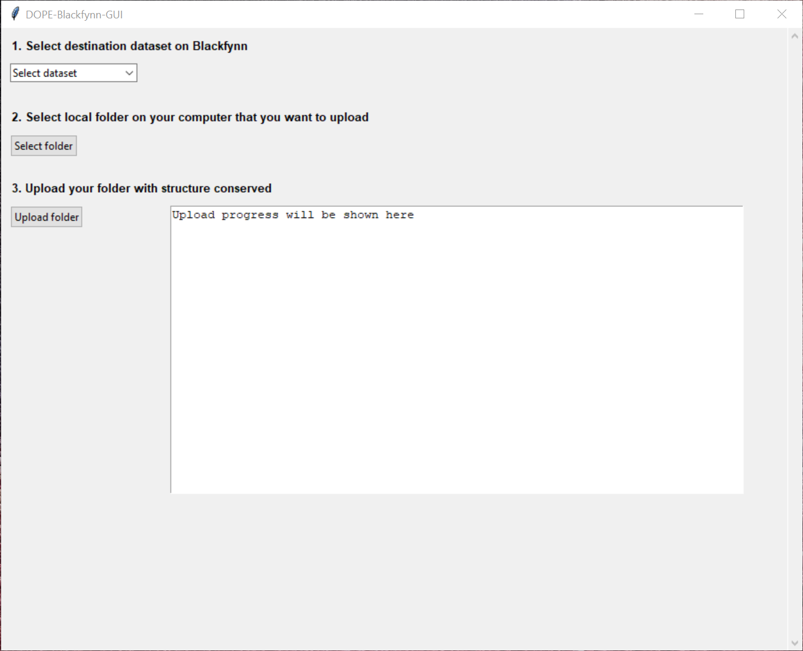

# DOPE-Blackfynn GUI

A Windows program, called DOPE-Blackfynn-GUI, for uploading nested folder from your computer to the Blackfynn platform without having to type any code or installing any other software. Everything that is required (Python, Blackfynn API, etc.) is prepackaged in this program. It provides a convenient GUI (shown in the picture below) wrapped around the Blackfynn Python API. Please follow the user manual for installation and usage guidelines. A method for setting up your Blackfynn profile on your computer without having to go through the command line is also provided in the user manual. The program has been tested on Windows 7, 8, and 10. Extension to Mac and/or Linux OS will be considered if there is a demand from the investigators (please email the developer with any such request). 

### Prerequisites

- Browser and Internet access

### Installing

Download this Github repository (click "Clone or download" and select "Download ZIP") and follow the instructions included in the user manual.

## Built With
* [Python 3] (https://www.python.org/download/releases/3.0/) - General-purpose programming language
* [tkinter] (https://docs.python.org/3/library/tkinter.html) - Python's de facto standard GUI
* [Blackfynn python API] (https://github.com/Blackfynn/blackfynn-python) - Python client and command line tool for Blackfynn

## Versioning

* Version 0.1 - First release of the GUI.

## Authors

* **Bhavesh Patel** -  [California Medical Innovation Institute](https://calmi2.org/)

## License

See the [LICENSE file](LICENSE.txt).

## Acknowledgments

Many thanks to Blackfynn for providing a great Python API

## Contact
Please email <bpatel@calmi2.org> for any question or comment.
